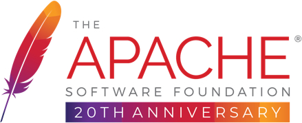

----

## OneStop工具平台：Nacos-Demo项目
#### 本项目基于Nacos2.0的Demo项目，配合os-biz的模块使其实现微服务框架

1. Nacos控制台模块
2. Nacos-Feign-Demo模块

---

#### OneStop工具平台地址：
Gitee：[https://gitee.com/clarkstore/os-parent](https://gitee.com/clarkstore/os-parent)

GitHub：[https://github.com/clarkstore/os-parent](https://github.com/clarkstore/os-parent)

#### Os-Biz基础平台地址：
Gitee：[https://gitee.com/clarkstore/os-biz](https://gitee.com/clarkstore/os-biz)

GitHub：[https://gitee.com/clarkstore/os-biz](https://gitee.com/clarkstore/os-biz)

#### Os-Nacos微服务平台地址：
Gitee：[https://gitee.com/clarkstore/os-nacos](https://gitee.com/clarkstore/os-nacos)

GitHub：[https://gitee.com/clarkstore/os-nacos](https://gitee.com/clarkstore/os-nacos)

---
### 开源协议
遵循 [Apache 2.0 协议](https://www.apache.org/licenses/LICENSE-2.0.html) ，
允许商业使用，但务必保留类作者、Copyright 信息。

---
### 赞助商

[感谢JetBrains IDEA对开源项目的支持](https://jb.gg/OpenSource)
